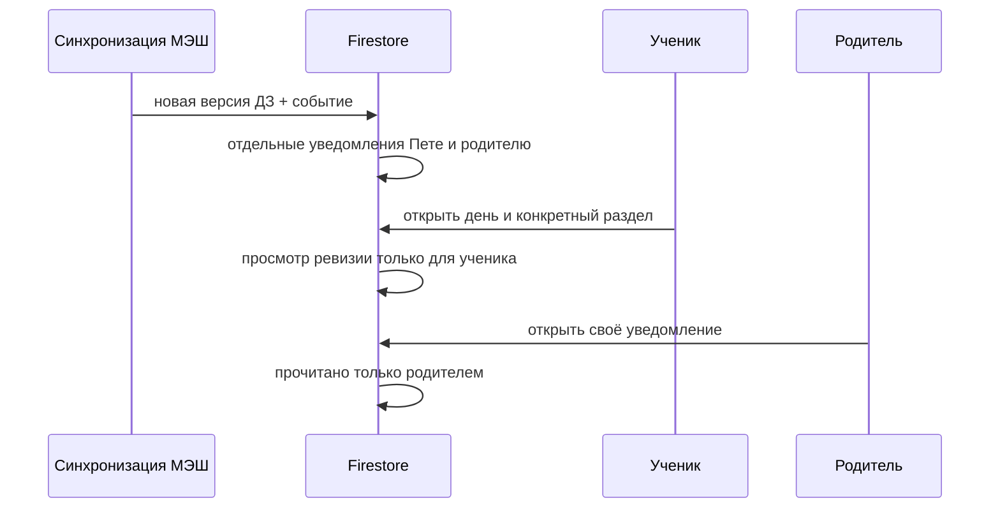

# Education: действия, просмотры и новое

Связанные контракты: [модель семьи](family-data-model.md), [экраны из данных](backend-driven-ui.md), [dashboard](../product/dashboard.md). Карта: [спецификации](../product/README.md).

## Журнал действий

`families/{familyId}/activity/{eventId}` — добавляемый один раз факт. Событие содержит `schemaVersion`, `actorUid`, `childId`, `type`, `viewId`, `sectionId?`, `entityId?`, `sessionId`, `occurredAt` (серверное время) и `clientAt?`. Основные типы: `page_opened`, `section_opened`, `day_opened`, `task_opened`, `test_started`, `test_submitted`, `submission_uploaded`, `notification_opened`. Для учебных изменений от сервера: `homework_published`, `homework_changed`, `homework_removed`, `grade_added`, `review_ready`.

Клиент не пишет в событие текст задания, ответы, фото, токены ссылок, OAuth-ключи или полный URL. Секреты и персональные материалы остаются в своих защищённых документах. `sessionId` — случайный идентификатор сеанса, не ключ доступа. Повторный показ того же раздела в одном сеансе не создаёт поток одинаковых событий; действия отправки сохраняются отдельно и связываются с предметной записью. Сбой записи аналитики не отменяет отправку работы.

Клиентские события описывают навигацию и взаимодействие, но не доказывают, что тест сдан или файл сохранён: такой итог подтверждается соответствующим документом и серверным событием. Родительский отчёт различает эти два источника.

## Просмотр и прочтение

Посещение страницы **не означает**, что ребёнок прочёл все блоки и выполнил ДЗ. `users/{uid}/views/{viewKey}` фиксирует увиденную ревизию конкретного раздела только после его открытия; действие хранит также `seenAt`. Новизна вычисляется относительно ревизии источника (`sourceRevision`), а не сравнением двух часов. Для индивидуальных уведомлений `users/{uid}/inbox/{notificationId}` хранит адресата, ссылку на предметное событие, `createdAt`, `readAt?`; открытие уведомления отмечает только его.

Новая оценка и изменённое ДЗ создают уведомление для нужных участников. Повторный импорт того же события не создаёт дубликат: ID уведомления выводится из ID исходного события и адресата. Родительское прочтение не меняет состояние ученика, и наоборот. На dashboard сначала показывается незавершённое ДЗ к ближайшему учебному дню, затем новые оценки. Прошлое просроченное ДЗ не переносится автоматически в текущий план.

## Отчётность и срок хранения

Журнал позволяет ответить, когда и кем был открыт день, конкретный раздел или задача, начат тест, загружена работа и прочитано уведомление. Для родителя это история действий ребёнка с серверным временем и ссылкой на предметную запись; отсутствие события означает только отсутствие зафиксированного действия. Сводки строятся сервером из журнала, а не доверяются клиентскому счётчику. Нужен явный срок хранения сырых посещений и агрегатов перед включением сбора для других семей; пока схема и правила подготовлены, но сбор не активирован.
