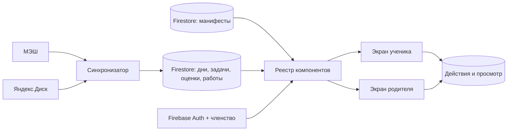

# Education: экраны из Firestore

Связанные контракты: [модель семьи](family-data-model.md), [события и новое](activity-and-inbox.md), [dashboard](../product/dashboard.md), [страница дня](../product/day-page.md). Карта: [спецификации](../product/README.md).

<a id="implementation"></a>
## Состояние реализации

Типы манифеста, его проверка, подписка `watchScreenManifest` и ограниченный компонент `EducationScreen` подготовлены. На 10.10.2026 действующие маршруты дня и dashboard **не используют** `EducationScreen` и `watchScreenManifest`: их композиция ещё задана в компонентах `DayPage` и `DayDashboard`. Данные заданий, фото и проверок на этих маршрутах уже приходят из Firestore по подпискам. Публикация нового задания или результата не требует выпуска сайта; изменение набора и порядка секций через манифест пока не действует на этих маршрутах.

<a id="manifest"></a>
## Манифест экрана

`families/{familyId}/ui/{viewId}` задаёт `schemaVersion`, `revision`, `audience`, порядок разделов, их видимость, подписи и ссылки на данные. Примеры `viewId`: `student-home`, `parent-home`, `student-day`, `parent-day`. У семьи могут быть общие настройки; содержание каждого ребёнка подставляется по `childId` из разрешённого контекста.

Манифест **не хранит исполняемый код, HTML, CSS или произвольные Firestore-пути**. Блок ссылается на типизированный источник вроде `nearest-homework`, `week-days`, `recent-grades`, `pending-reviews`, `day-schedule`, `day-homework`. Клиент знает только конечный реестр компонентов и источников. Неизвестный `schemaVersion` или тип блока приводит к явному сообщению об обновлении, а не к молчаливой подмене или выполнению содержимого.



```json
{
  "schemaVersion": 1,
  "revision": 7,
  "audience": "student",
  "blocks": [
    { "id": "next-homework", "type": "homework-focus", "source": "nearest-homework", "title": "Что сделать к следующему уроку" },
    { "id": "days", "type": "day-strip", "source": "week-days", "title": "Дни" },
    { "id": "grades", "type": "grade-summary", "source": "recent-grades", "title": "Оценки" }
  ]
}
```

<a id="rendering"></a>
## Граница клиента

Код клиента определяет доступные элементы управления, ридер страниц, загрузку фото и прохождение тестов. Firestore определяет **какие** блоки показать, их порядок, допустимые настройки и конкретные учебные данные. Компоненты не содержат дат, имён, заданий или оценок конкретного ребёнка. Любой блок отображает загрузку, отсутствие источника и устаревшие данные явно. Различие ролей проверяется и при чтении манифеста, и в правилах доступа к исходным документам.

Для нумерованного листа учителя клиентский компонент [адаптивной карточки](../product/adaptive-problem-card.md) неизменен, а точный текст номера, ссылка на оригинал и уровень начальной помощи приходят как данные конкретного ребёнка. Новый разбор или исправление меняет педагогический слой через Firestore, без перевыпуска сайта. Оригинал не переписывается по траектории ученика.

Два экрана одного дня читают одни `days`, `tasks`, `submissions` и `grades`. Родительский манифест добавляет сведения о проверке и источниках, ученический — ближайшее действие. Подготовленный агентом текст у задания хранится вместе с `sourceRevision` и ссылкой на учебник; при изменении условия прежний разбор помечается требующим сверки.

<a id="navigation"></a>
## Переходы

Пользователь выбирает день на dashboard и открывает существующий вид страницы дня для этого `childId` и даты. Кнопка «Назад» возвращает к dashboard, сохраняя выбранный день. Тесты и фото открываются из карточек заданий; их прогресс и статусы приходят из отдельных документов. Отсутствие подробного разбора не блокирует точный исходный текст МЭШ.

<a id="configuration"></a>
## Что настраивается

Можно менять состав и порядок известных блоков, названия, границы ленты, порог мягкого предупреждения об оценке, правила видимости и акцент родительского/ученического экранов. Изменения манифеста — серверная публикация с ревизией и историей. Нельзя настройкой обойти права, подставить чужой `childId` или скрыть обязательное указание, что ДЗ ещё не опубликовано.
