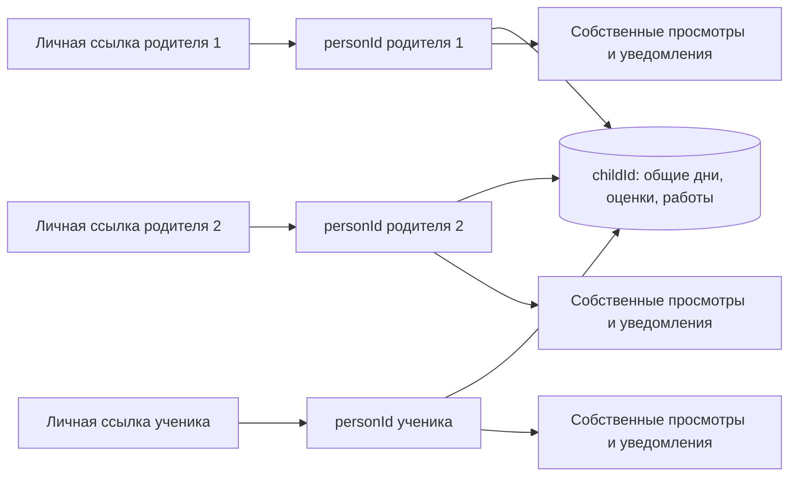

# Education: данные семьи и права доступа

Связанные контракты: [экраны из данных](backend-driven-ui.md), [события и новое](activity-and-inbox.md), [текущие маршруты](../product/access-and-state.md). Карта: [спецификации](../product/README.md).

## Источник истины

Firestore хранит учебные факты, состояние работы и настройки экранов. Клиентские страницы — представления этих данных. МЭШ, Яндекс.Диск и локальный агент остаются адаптерами: МЭШ даёт исходные задания и оценки, Диск — файлы, агент — проверенный разбор. Их результаты попадают в Firestore с источником, версией и временем проверки.

Статус работы, ответы, фото, просмотр и уведомления не должны жить внутри документа страницы, который перезаписывает синхронизация. Повторная синхронизация может менять опубликованное условие, но не удаляет ученическое доказательство. Если условие снято или изменилось, исходная работа сохраняется в истории, а в актуальном плане появляется соответствующая пометка.

## Адреса документов, версия 2

| Путь | Содержание | Кто пишет |
|---|---|---|
| `users/{personId}` | Постоянный профиль родителя или ученика | агент через Admin SDK |
| `users/{personId}/families/{familyId}` | Указатель на доступную семью | агент через Admin SDK |
| `users/{personId}/families/{familyId}/shortcuts/{childId}` | Личный переход к прежней странице дня на время миграции | агент через Admin SDK |
| `accessLinks/{secret}` | Длинная отзывная ссылка на `personId`; клиент читает только собственную действующую ссылку после создания сессии | агент через Admin SDK |
| `deviceSessions/{authUid}` | Техническая сессия Firebase Auth с личной ссылкой | браузер после открытия ссылки |
| `families/{familyId}/members/{personId}` | Роль `parent` или `student`, точный список доступных `childIds`, активность | агент через Admin SDK |
| `families/{familyId}/children/{childId}` | Профиль ученика, учебный год, часовой пояс | сервер |
| `families/{familyId}/children/{childId}/days/{yyyy-mm-dd}` | Расписание, исходное ДЗ, версии задания, проверенный план | синхронизатор / агент |
| `families/{familyId}/children/{childId}/tasks/{taskId}` | Стабильная задача, срок, статус публикации, ссылка на источник | синхронизатор / агент |
| `families/{familyId}/children/{childId}/submissions/{submissionId}` | Фото/ответ, статус проверки, связь с задачей | пока сервер; запись из браузера откроется после безопасной загрузки на Диск |
| `families/{familyId}/children/{childId}/grades/{gradeId}` | Оценка, вес, предмет, дата, исходный идентификатор МЭШ | синхронизатор |
| `families/{familyId}/ui/{viewId}` | Версионированная композиция экрана для роли | сервер |
| `families/{familyId}/activity/{eventId}` | Действие участника; только добавление | клиент или сервер |
| `users/{personId}/inbox/{notificationId}` | Адресное уведомление и время просмотра | агент/сервер создаёт; адресат отмечает прочитанным |
| `users/{personId}/views/{viewKey}` | Последняя увиденная ревизия раздела | адресат |

`familyId`, `childId`, `personId` и технический `authUid` — независимые непрозрачные идентификаторы. Один родитель может быть связан с несколькими детьми, а один ребёнок — с несколькими родителями. Каждый родитель получает отдельную личную ссылку, но читает **те же документы ребёнка**, что и другие связанные родители. Список `childIds` проверяется для обеих ролей; принадлежность к семье сама по себе не даёт доступа ко всем детям. Детские и родительские экраны различаются ролью и разрешёнными блоками, а не переключателем в URL. Дату и время учебного дня считают в часовом поясе ребёнка.

## Доступ

Личная ссылка имеет вид `https://rubaxa.github.io/education-quizzes/#/enter/<secret>`, где `secret` — 32 случайных байта в URL-безопасной записи. Это **ключ доступа**: получивший ссылку сможет войти под соответствующим профилем. Ссылка может быть повторно открыта на другом устройстве и отозвана или заменена агентом. Токен находится после `#`, поэтому не отправляется GitHub Pages как часть HTTP-запроса; после входа приложение убирает его из адресной строки. Токены не попадают в Git, аналитику и общедоступный PWA-манифест.

Firebase Authentication выдаёт устройству анонимный технический `authUid`. Браузер записывает `deviceSessions/{authUid}` со ссылкой; правила Firestore сверяют её с закрытым `accessLinks/{secret}` и получают постоянный `personId`. При каждом обращении правила повторно проверяют, что ссылка не отозвана, а затем проверяют `families/{familyId}/members/{personId}` и точный `childId`. Клиент не может назначить себе роль, привязать ребёнка или изменить профиль. Это вход **по ссылке**, без отдельного пароля и административного интерфейса. Провайдер Anonymous включён в проекте через `firebase deploy --only auth`; его конфигурация хранится в `firebase.json`. [Документация Firebase](https://firebase.google.com/docs/auth/configure-providers-cli).

Анонимный UID принадлежит устройству, а не человеку. После смены телефона тот же человек открывает свою ссылку снова и видит собственные уведомления и просмотры. У двух родителей разные профили и состояния просмотра, но общие учебные документы ребёнка. Получивший чужую личную ссылку получает и её права; утраченную ссылку нужно отозвать и выпустить новую.

На iPhone установленное приложение может иметь отдельное от Safari хранилище сессии. При первом запуске с иконки после установки пользователь нажимает вход по личной ссылке из буфера; если чтение буфера недоступно, вставляет её вручную. Дальше техническая сессия сохраняется на этом устройстве. Ссылка на день или тест не заменяет личную ссылку профиля, и экран входа объясняет различие. Ссылка не встраивается в публичный `start_url`.

Ролевой индекс `dayDashboards/<token>` доступен после личного входа только участнику семьи, привязанному к его `familyId` и `childId`, при совпадении роли. Перечисление и запись индексов из браузера закрыты. Старые ссылочные страницы дня и тесты — отдельный переходный контракт, который нужно закрыть после переноса данных и входа пользователей, не обрывая текущую работу ученика.

## Синхронизация и идентичность

У каждого задания есть `sourceSystem`, `sourceId`, `dueDate`, `sourceRevision`, `checkedAt` и собственный стабильный `taskId`. Исторический снимок условия не удаляется. Повторный импорт той же версии идемпотентен. Новая версия меняет опубликованное условие и создаёт событие изменения; фото, ответы и тестовые попытки ссылаются на стабильный `taskId` и прежнюю версию условия.

Индексы dashboard могут быть денормализованы для быстрого чтения, но они производные от этих документов. Их можно пересобрать без потери действий ученика. Ограничение видимых дат и сроков ДЗ описано в [dashboard](../product/dashboard.md).

## Переход с нынешних ссылок

1. Агент создаёт семейство, постоянные профили, связи и отдельные ссылки для каждого человека. Административного интерфейса нет.
2. Перенести `dayPages`, `dayUploads`, назначения и попытки тестов с картой старых токенов на стабильные ID. Сверить число работ и результатов до смены маршрутов.
3. Включить вход по личным ссылкам и новые защищённые маршруты. Родитель и ученик открывают экраны через постоянные профили, даже если технические `authUid` различаются между устройствами.
4. После проверки переноса закрыть старые ссылочные правила и убрать токены из новых документов. Исходные снимки МЭШ и файлы на Диске остаются неизменными.

Ни один шаг не удаляет данные только потому, что документ исчез из текущего представления.

## Заведение профилей агентом

`npm run family -- create "Имя ребёнка" "Родитель"` создаёт семью, два профиля, связи и две личные ссылки. `add-parent` привязывает нового родителя к выбранным детям, `add-child` — нового ребёнка к выбранным родителям, `link` добавляет существующую связь. `issue-link` выпускает ещё одну ссылку профиля; `revoke-links` отзывает все его ссылки. `link-url` явно показывает последнюю действующую ссылку выбранного профиля для передачи адресату. `attach-current-day` добавляет личный переход на уже опубликованную страницу дня. Команда использует Admin SDK только локально; реестр с ID и ссылками хранится в исключённом из Git `.local/family-access.json` с правами `0600`. Обычные команды не печатают секрет ссылки. В браузере функций управления семьёй нет.

Пока действует переходная модель, личная точка входа ведёт на прежнюю страницу дня из Firestore. Эта страница и тесты всё ещё защищаются старыми токенами. Новые семейные правила не считаются полной миграцией, пока дневные данные и загрузки не перенесены в `families/.../children/...`, а старые публичные маршруты не закрыты.

## Состояние реализации

Типы документов, проверка манифеста, вход по ссылке и агентская команда подготовлены. Старые страницы дня и тестов остаются переходным маршрутом до переноса работ.

- [x] Описать доменные документы, роли, манифест, события и адресное состояние просмотра.
- [x] Добавить типы, проверку манифеста и закрытые правила для новых путей.
- [x] Выбрать вход каждого человека по длинной отзывной ссылке.
- [x] Подготовить агентскую команду заведения семьи и клиентский вход по ссылке.
- [x] Опубликовать новые правила Firestore после разрешения родителя.
- [x] Включить Anonymous в Firebase Authentication на бесплатном тарифе.
- [x] Создать первую семью, профили родителя и ребёнка и их ссылки командой агента; переходы к прежнему дню опубликованы.
- [ ] Перенести дни, фото, тесты и оценки; сверить полноту и связи.
- [ ] Подключить защищённые маршруты и реальные блоки dashboard/дня к данным v2.
- [ ] Запустить создание уведомлений при синхронизации и сбор действий после выбора срока хранения.
- [ ] Закрыть прежние ссылочные правила после подтверждения переноса.
