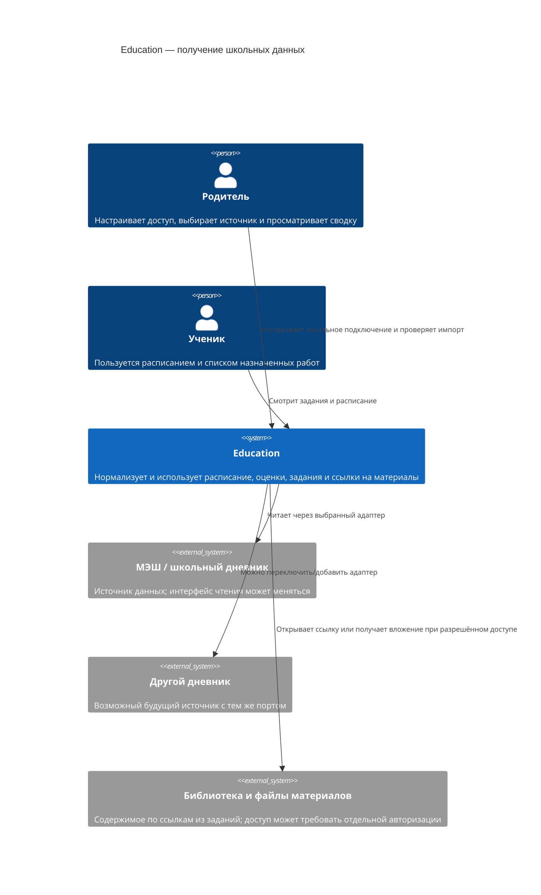
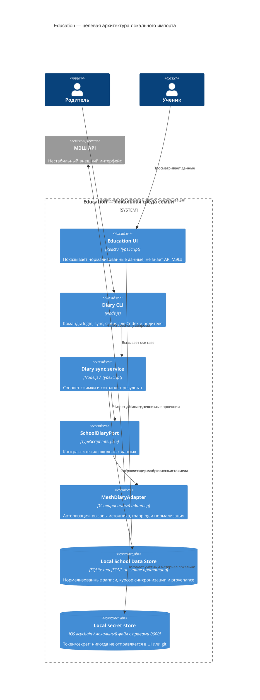
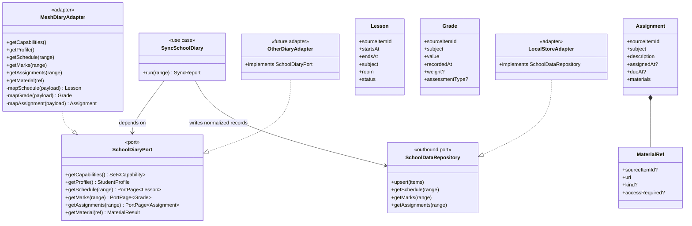
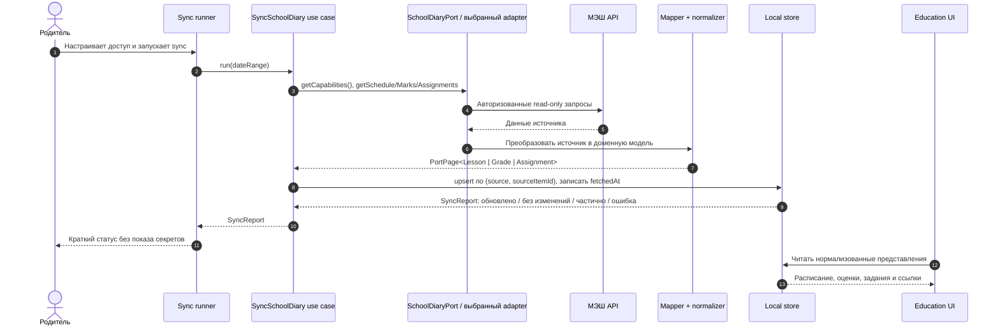

# Подключение школьного дневника: порт и адаптеры

**Состояние пилота.** Граница МЭШ локализована в `diary/adapters/mesh.mjs`, а `diary/application/sync.mjs` сохраняет снимки и diff. Формальный `SchoolDiaryPort`, общие доменные сущности и репозиторий канонических записей ниже остаются **целевой архитектурой**, не описанием готового кода. Страница дня публикуется из локального `.local/day-source-<дата>.json` в Firestore; фото и тесты живут в отдельных коллекциях. Ученический браузер не вызывает МЭШ и не получает его токен. Смежные правила собраны в [карте спецификаций](../product/README.md).

<a id="diary-adapter"></a>
## Цель

Подключить МЭШ как первый источник расписания, оценок, домашних заданий и ссылок на материалы. Остальная Education-система должна работать с собственной моделью школьных данных, а не с типами и ответами конкретного API. Если источник сменится, добавляется или заменяется адаптер; порт и потребители остаются прежними.

На 07.10.2026 в проверенных источниках не найден опубликованный и гарантированный для родительских интеграций API дневника. Сторонние клиенты сообщают, что обращаются к API МЭШ, но описывают его как изученный по работающим клиентам/приложениям. Считаем его внешним нестабильным интерфейсом, даже если конкретные endpoint доступны.

## Варианты

| Вариант | Граница | Плюсы | Минусы | Когда подходит |
|---|---|---|---|---|
| A. Вызовы МЭШ из интерфейса | React-страницы сами вызывают API источника | Мало кода в начале | Утечка токенов в браузер; детали МЭШ распространяются по UI; замена источника затрагивает много мест | Не использовать для личных данных ребёнка |
| B. Адаптер внутри монолита | Use case вызывает стабильный `SchoolDiaryPort`; адаптер переводит API МЭШ в общую модель | Самая малая полезная абстракция; легко переключать источник; не нужен отдельный публичный API | Процесс автоматической синхронизации всё ещё надо где-то запускать | Рекомендуемый первый шаг: один пользователь, локальный read-only сбор |
| C. Отдельный connector service | Локальный или закрытый сервис реализует порт и отдаёт REST API | Несколько приложений могут читать один набор нормализованных данных; понятен контракт HTTP | Дополнительная эксплуатация, авторизация и обновления; раннее усложнение | Добавить, когда появится второй реальный потребитель или удалённый клиент |
| D. Общая библиотека SDK | Все источники и доменные типы объединены в публикуемом пакете | Удобно переиспользовать в нескольких репозиториях | Версионирование пакета и обратная совместимость до доказанной необходимости | Рассмотреть при втором приложении/команде |

**Решение для прототипа:** вариант B, порт-адаптеры (Hexagonal Architecture / Ports and Adapters), плюс anti-corruption layer в адаптере. Вначале это наш локальный CLI, прикладной сервис синхронизации в том же процессе и локальное хранилище. Сторонний клиент МЭШ может использоваться только внутри `MeshDiaryAdapter` после проверки кода; он не задаёт интерфейс Education. Публичный HTTP API не входит в прототип; при необходимости его можно добавить поверх тех же use case и порта (вариант C), не меняя контракты поставщика данных.

## C4 — контекст системы



## C4 — целевые контейнеры и граница заменяемости



UI, Firestore и статический GitHub Pages сайт не должны хранить токены МЭШ. Первый коннектор запускается локально. Если позже потребуется синхронизация с хостингом, отдельно пересматриваем размещение, секреты, авторизацию родителей и минимизацию данных до начала разработки этого deployment-варианта.

**Текущий поток:** `diary CLI` → снимки `.local/diary/` → `day/build.mjs` и ручная редактура `.local/day-source-<дата>.json` → `dayPages` Firestore → страницы на GitHub Pages. `dayUploads` и документы тестов дополняют опубликованный план; файлы работ архивируются на Яндекс.Диске. Локальный исходник сейчас является единственным редактируемым источником плана. Повторный выпуск сохраняет отдельные фото и попытки, но при исчезновении задания из МЭШ старый пункт пока остаётся без отметки об отмене. Для этого нужна отдельная семантика изменения назначения, а не молчаливое удаление.

### Целевая структура кода и текущее расположение

```text
education-quizzes/
  diary/                    # наш код; хранится в Git
    domain/                 # Lesson, Grade, Assignment и другие общие типы
    ports/                  # SchoolDiaryPort и SecretStorePort
    application/            # SyncDiary, сравнение снимков, статус
    adapters/mesh/          # единственное место, знающее API МЭШ
    adapters/local-store/   # сохранение нормализованных снимков
    cli/                    # команды login, sync, status
  .env.example              # имена и смысл локальных настроек, без значений доступа
  .env.local                # выбранный provider, часовой пояс, путь к данным; исключён из Git
  .local/diary/             # секреты с правами 0600 и личные снимки; исключено из Git
```

Первый CLI реализован в `diary/cli.mjs`, адаптер — в `diary/adapters/mesh.mjs`, снимки и diff — в `diary/application/` и `diary/local-store.mjs`. Папок `diary/domain/` и `diary/ports/` пока нет: дерево выше задаёт направление рефакторинга. Команды: `npm run diary -- doctor`, `login`, `verify`, `sync --date YYYY-MM-DD`, `files --date YYYY-MM-DD`, `status`. `verify` сверяет роль `ParentProfile` и связь выбранного ученика с родителем. Для расписания используется идентификатор ученика, а идентификатор владельца токена хранится отдельно. ДЗ выбранного дня берётся из подробных карточек расписания; короткий endpoint не считается достаточным без проверки даты урока. `.env.local` — конфигурация процесса, не хранилище пароля. Секрет хранится в `.local/diary/secret.json` с правами `0600`. Полная нормализация и сверка журнала оценок с официальным экраном ещё не реализованы.

Новая сессия Codex в этом проекте запускает ту же отслеживаемую команду CLI. Для работы на другом компьютере потребуется отдельный безопасный перенос доступа или новая авторизация; локальный токен сам по себе не переносится между устройствами.

## Порт и модель данных

Порт описывает возможности, нужные Education, а не эндпоинты конкретного дневника. Возвращаемые коллекции должны различать пустой результат и неподдерживаемую возможность.

```ts
type DateRange = { from: string; to: string; timeZone: string };
type Capability = "schedule" | "marks" | "assignments" | "attendance" | "materials";

interface SchoolDiaryPort {
  getCapabilities(): Promise<Set<Capability>>;
  getProfile(): Promise<StudentProfile>;
  getSchedule(range: DateRange): Promise<PortPage<Lesson>>;
  getMarks(range: DateRange): Promise<PortPage<Grade>>;
  getAssignments(range: DateRange): Promise<PortPage<Assignment>>;
  getAttendance?(range: DateRange): Promise<PortPage<Attendance>>;
  getMaterial(ref: MaterialRef): Promise<MaterialResult>;
}

type PortPage<T> = {
  items: T[];
  nextCursor?: string;
  fetchedAt: string;
  source: SourceRef;
};
```

Дополнительные правила контракта:

- Идентификатор источника хранится как `sourceItemId`; он не становится глобальным ID записи.
- Доменные записи включают `source`, `collectedAt` и исходную дату/время события. Сырые payload, если нужны для диагностики mapping, отделяются от UI-модели, исключаются из Git и имеют ограниченный срок хранения.
- Оценка содержит значение, предмет, дату, вес и вид контроля только когда поставщик действительно их передал. Неизвестное поле остаётся `null`/отсутствующим, не вычисляется догадкой.
- Задание отделяет текст и срок сдачи от `MaterialRef[]`. Ссылка на материал не означает, что файл удалось скачать или что ссылка публична.
- Ошибки адаптера переводятся в общие типы: `AUTH_REQUIRED`, `RATE_LIMITED`, `TEMPORARY_FAILURE`, `UNSUPPORTED`, `PARTIAL_DATA`. Ошибка входа не должна превращаться в «нет заданий».
- Команды прототипа только читают. Отправка сообщений, сдача заданий, отметки об ознакомлении и любые изменения оценок не включаются в порт.

## UML — классы и подмена адаптера



Выбор адаптера делается конфигурацией/DI composition root (`provider: "mesh"`). Потребители зависят от интерфейса и общей модели, а не проверяют `if (provider === "mesh")`. Для замены провайдера меняются адаптер и конфигурация; если семантика нового источника отличается, это отражается в маппинге, поддерживаемых capabilities и метаданных, а не в UI.

<a id="visibility"></a>
Подтверждённые семейные поправки к расписанию применяются **после импорта** в use case подготовки дня, а не внутри `MeshDiaryAdapter`. Исходный `Lesson` сохраняется; закрытое правило видимости с причиной, датой действия и источником хранится в игнорируемом `.local/diary/lesson-visibility.json`. Ученический экран и счётчик проводимых уроков используют это правило, а родительский аудит может видеть расхождение. При смене дневника правило сопоставляется с общим предметом/уроком, а не с внутренним ID МЭШ.

Первый локальный слой этой политики — [lesson-visibility.mjs](../../diary/application/lesson-visibility.mjs). `sync` сохраняет исходные строки, CLI `status` сообщает число проводимых уроков отдельно, а генератор дня использует тот же слой. Отсутствие среднего в МЭШ не должно превращаться в оценку `0`: это отдельная неполная capability.

<a id="sync"></a>
## Последовательность синхронизации



## Контракт расширения

1. Пилот читает расписание, сводку оценок, задания и ссылки на файлы учителя. PDF и PNG из подробных карточек урока уже можно скачать локально командой `files`; цифровые интерактивные ресурсы и их доступность ещё не проверены. В формальном порте это разные capabilities.
2. Добавляем второй тестовый adapter, реализующий тот же порт (может быть fake/in-memory), чтобы отрабатывать сценарии без настоящей учётной записи МЭШ.
3. При реальной смене источника проверяем сопоставимость оценок, дедупликацию и ограничения по истории. Общий API не обещает одинаковые данные, если источник их не предоставляет.
4. Если будет нужен удалённый клиент, над use case добавляется версионированный HTTP facade (`GET /v1/schedule`, `/v1/marks`, `/v1/assignments`, `GET /v1/materials/{id}`). Сначала он остаётся локальным и защищённым; не публикуется открыто в Интернет.

## Основания и открытые вопросы

- Официальный «Дневник МЭШ» перечисляет расписание, подробности оценок, домашние задания, ссылки на материалы и скачивание вложений: [App Store](https://apps.apple.com/ru/app/%D0%B4%D0%BD%D0%B5%D0%B2%D0%BD%D0%B8%D0%BA-%D0%BC%D1%8D%D1%88/id1475774929).
- Примеры сторонних реализаций порта источника: [mesh-diary CLI](https://github.com/voenniy/mesh-diary), [SchoolMosPy](https://github.com/xd2dd/schoolmospy), [OctoDiary-py](https://github.com/OctoDiary/OctoDiary-py). Это свидетельства технической возможности, не гарантия официальной поддержки API.
- В пилоте выбраны локальные JSON-снимки, родительский вход через `mos.ru` и ручной запуск синхронизации. Расписание автоматического запуска и защищённое постоянное хранилище пока не выбраны.
