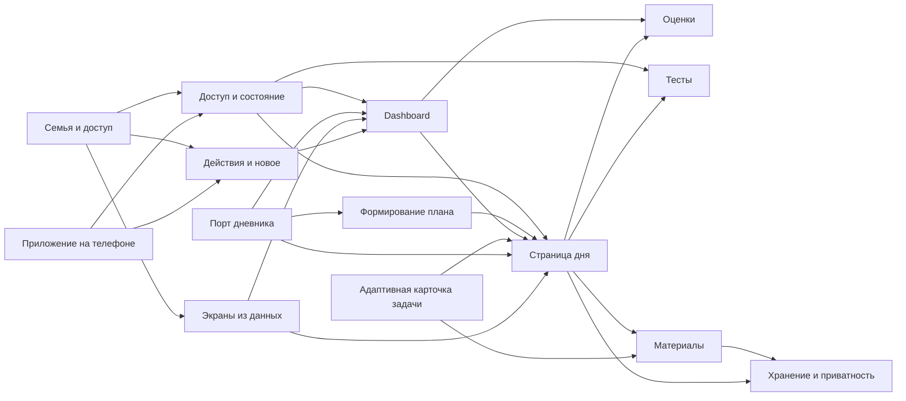

# Карта спецификаций Education

Каждый контракт описывает одну границу продукта и остаётся короче 500 строк. Это **граф**, а не один документ, в который копируется всё: смежные документы ссылаются друг на друга, а код через JSDoc `@see` ведёт к ближайшему правилу.

| Контракт | Что определяет | Основные модули |
|---|---|---|
| [Доступ и состояние](access-and-state.md) | Маршруты, роли, документы Firestore, повторный выпуск | `src/App.tsx`, `src/lib/store.ts`, `src/lib/dayStore.ts`, `day/merge.mjs` |
| [Страница дня](day-page.md) | Дата ДЗ, карточки, фото, связь теста с предметом | `src/DayPage.tsx`, `day/build.mjs`, `scripts/day.mjs` |
| [Адаптивная карточка задачи](adaptive-problem-card.md) | Точный оригинал, отдельные ориентиры, свидетельства навыка и запрос помощи | `src/components/ProblemStatement.tsx`, `src/lib/dayStore.ts`, `src/WeekendMathSlot.tsx`, `src/DayPage.tsx`, `scripts/day.mjs` |
| [Формирование плана](plan-generation.md) | Граница точной записи МЭШ, проверенного разбора и неопределённости | `day/build.mjs`, `scripts/day.mjs`, `src/DayPage.tsx` |
| [Многодневный dashboard](dashboard.md) | Полоса дат, сводки и контракт будущей многодневной синхронизации | `src/DayDashboard.tsx`, `src/lib/dayDashboardStore.ts`, `day/dashboard-index.mjs`; многодневная синхронизация и полная история версий ДЗ ещё не реализованы |
| [Тесты](quizzes.md) | Попытка, сохранение, результат, списки | `src/App.tsx`, `src/components/SubjectTheme.tsx`, `src/lib/quiz.ts` |
| [Материалы](materials.md) | Точный источник, страницы, ридер | `src/components/MaterialReader.tsx`, `src/lib/yandexPublic.ts`, `storage/material-pages.mjs` |
| [Средний балл](grades.md) | Метка, условный сценарий и границы точности | `src/DayPage.tsx` |
| [Хранение и приватность](storage-privacy.md) | Яндекс.Диск, временная очередь, очистка копий | `scripts/storage.mjs`, `storage/yandex-disk.mjs`, `src/lib/dayStore.ts` |
| [Порт дневника](../architecture/school-diary-port-adapter.md) | Изоляция МЭШ, семейные правила видимости | `diary/`, `scripts/day.mjs` |
| [Семья и доступ](../architecture/family-data-model.md) | Семьи, роли, дети, источник истины и перенос ссылочной модели | `src/lib/educationSchema.ts`, `firestore.rules` |
| [Экраны из данных](../architecture/backend-driven-ui.md) | Безопасный манифест и реестр блоков вместо статичного макета | `src/lib/educationSchema.ts`, `src/components/EducationScreen.tsx` |
| [Действия и новое](../architecture/activity-and-inbox.md) | Журнал посещений, ревизии просмотра и адресные уведомления | `src/lib/educationStore.ts`, `firestore.rules` |
| [Приложение на телефоне](pwa.md) | Установка на iPhone, обновление кода, кеш и граница push | `src/lib/pwa.ts`, `pwa/sw-template.js`, `scripts/generate-sw.mjs` |

Семейные планы, токены, снимки дневника, фото работ и привязки конкретных учебников лежат в закрытом локальном проекте или на Яндекс.Диске; эта карта не содержит их. Публичный исходный репозиторий и ветка сайта не должны содержать сами изображения. Перед выпуском проверяются и текущие файлы, и история Git: удаление файла новым коммитом не удаляет его из старых коммитов.
