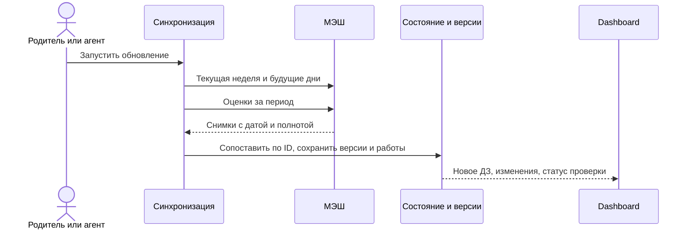

# Многодневный dashboard Education

Статус: **личные ссылки ведут сразу на ролевой dashboard; календарь и переход к существующей странице дня работают через Firestore. Многодневная синхронизация ещё не реализована**. Связанные контракты: [страница дня](day-page.md), [доступ и состояние](access-and-state.md), [оценки](grades.md), [тесты](quizzes.md), [материалы](materials.md) и [порт дневника](../architecture/school-diary-port-adapter.md). Карта: [README](README.md).

## Назначение и даты

Dashboard — точка входа ученика и родителя в уже связанные дни, ДЗ, оценки, тесты и работы. Главный акцент ученика — то, что важно **сейчас**, прежде всего незавершённые действия к ближайшему учебному дню. «Завтра» не хранится как дата ДЗ: в пятницу ближайшим днём сдачи может быть понедельник. Новый школьный балл появляется ниже срочного ДЗ. Родитель сначала видит изменения и то, что требует внимания, по ранее принятому ролевому контракту.

В данных различаются `viewDate` (выбранная дата), `lessonDate` (дата урока), `dueDate` (дата сдачи ДЗ), `plannedWorkDate` (когда ученик собирается делать отдельную работу) и `fetchedAt` (время последней успешной проверки МЭШ). Все подписи для семьи вычисляются в `Europe/Moscow`. ДЗ относится только к своему `dueDate`: незавершённое за прошедшую дату не переезжает в список следующего дня. Работа, выполненная заранее, остаётся связанной с будущим заданием и видна в его карточке.

## Полоса дней и выбранный день

- При входе открывается текущая московская дата; действующее правило [переключения расписания и ДЗ](day-page.md#day-page) сохраняется. Dashboard может выделить ближайший срок ДЗ, не меняя выбранную дату без действия пользователя.
- Сегодняшняя дата всегда выделена отдельной подписанной рамкой в полосе дат. Это указатель текущего московского дня, а не подсветка последнего нажатия; при просмотре другого дня он остаётся на сегодняшней дате.
- Нажатие на дату открывает существующий компонент [страницы дня](day-page.md#day-page), без второй реализации его карточек: расписание относится к нажатой дате, а вкладка ДЗ — к следующему учебному дню по МЭШ. Кнопка «Назад к dashboard» возвращает к календарю. Сводка «ДЗ к ближайшему дню» ведёт на страницу текущего дня и сразу выбирает вкладку ДЗ, где находятся инструкции, тесты и загрузка работы.
- Полоса показывает всю текущую неделю, затем **все будущие даты, для которых МЭШ дал расписание**. Более ранние сохранённые дни доступны через календарь.
- Выходные и другие даты без школьного расписания видны между учебными днями как неактивные отметки. Они не создают пустые школьные страницы. Отдельная работа на выходных может быть показана в главной сводке и связана со своим сроком сдачи.
- Будущий день с расписанием доступен даже без ДЗ. В его блоке написано «ДЗ пока не опубликовано» и показано время последней успешной проверки. Формулировку «ДЗ нет» нельзя выводить из пустого ответа МЭШ.
- Если пришла только часть будущего расписания, интерфейс должен обозначить неполноту. Правило, по которому определяется полнота недели, нужно уточнить в реализации по данным МЭШ; отдельный ранний урок не следует выдавать за окончательное расписание.
- Карточки выбранного дня используют существующий [контракт страницы дня](day-page.md#day-page): точные источники, фото, связанные тесты и их собственные статусы. Будущие задания доступны для работы заранее.

## Сводки ученика и родителя

Ученик видит краткую сводку действий к ближайшему учебному дню. Она ведёт к конкретным предметам, тестам и требуемым фото. В выходные отдельно видно запланированную внешкольную работу; она ссылается на **то же задание** и его срок сдачи, без второго независимого статуса. Визуальную композицию сводки предстоит прототипировать; контракт фиксирует содержание и приоритет, а не размеры карточек.

Новая оценка показывается компактной карточкой: оценка, предмет, текущий средний; подробности раскрываются по нажатию. Общий блок оценок показывает все предметы с опубликованным средним и раскрывает список сохранённых отметок каждого предмета; дата среза не выдаётся за живую проверку МЭШ. Средний и условные сценарии подчиняются [контракту оценок](grades.md#dashboard-grade-list), включая спокойный вид чистой `5,00`. Балл, выполнение ДЗ и освоение навыка не смешиваются.

Родитель входит по отдельной ссылке без переключателя роли. На первом экране он видит изменения после синхронизации и открытые вопросы: добавленное или изменённое ДЗ, новые оценки, ожидающие разбора фото, исправления и тесты. Тексты учителя и версии заданий остаются доступны для сверки. Дополнительная детализация интерфейса родителя остаётся задачей прототипа; существующие права и [состояние Firestore](access-and-state.md) не заменяются общей публичной страницей.

## Повторяемая синхронизация

Один запуск проверяет заново даты **текущей недели** и **все будущие дни, для которых обнаружено расписание**. Отдельно он получает сводку оценок за текущий аттестационный период, чтобы поздняя публикация оценки за прошлый урок не зависела от окна ДЗ. Сканирование будущего горизонта должно обнаруживать новые дни; фиксированный список ранее сохранённых дат для этого недостаточен. Безопасный предел запросов и способ обнаружения конца горизонта требуют отдельного технического решения.

Синхронизация хранит время и полноту каждого ответа, сравнивает записи МЭШ по устойчивому ID урока/задания и публикует **только подтверждённое изменение**. При ошибке доступа последний успешный снимок остаётся, но его возраст виден; ошибка не превращает задания в «отменённые». Два урока с одинаковым текстом ДЗ сохраняют свои исходные ID: визуальная группировка допустима только без потери происхождения и статусов.

Новое ДЗ показывается сразу **точным текстом МЭШ** с пометкой «разбор готовится». Позже агент сверяет учебник, материалы, формулирует действия и при необходимости связывает тест; неподтверждённый текст не маскируется под проверенный разбор. Условия [точного источника](materials.md) и [создания теста](quizzes.md) сохраняются.

Если учитель убрал задание, оно уходит из актуального плана, а прежнее условие, фото, ответы и история изменения сохраняются; родитель видит отмену. Если текст изменился после загрузки работы, фото не теряется, появляется статус «условие изменилось — сверить работу». Ни изменение, ни отмена не удаляют доказательства и не назначают новую загрузку автоматически. В старые незавершённые ДЗ других дат эти изменения не переносятся.

## Граница первой реализации

Первый выпуск должен дать отдельные ролевые маршруты dashboard, полосу дней, переход в существующую страницу дня, честный пустой будущий день, краткие сводки, версионированное обновление и сохранение доказательств. Он не требует автоматического педагогического разбора фото или полностью автоматического поиска страниц учебника: их состояние должно быть показано честно.

Старый `education-quizzes/.local/prototypes/dashboard-v1.html` — статичный макет и больше не должен быть точкой входа после включения Firestore-маршрутов. Упрощённый второй экран дня удалён. Опубликованные страницы подготовлены для 7–9 октября; для иных дат dashboard показывает точный снимок МЭШ с датой проверки и говорит, что подробная страница ещё не подготовлена.

Текущая команда `day refresh` работает лишь с выбранным днём и ближайшим учебным днём; она сразу публикует типовую страницу и ещё не выполняет контракт многодневной синхронизации. В существующей странице также нет канонической базы версий заданий. До построения dashboard нужно согласовать модель этой базы и процедуру перехода без потери Firestore-фото, тестов и отдельных токенов дней.

## Источник интерфейса и доступ

`dayDashboards/<token>` — ролевой индекс дат. Он содержит проверенные снимки МЭШ: расписание, точные записи ДЗ, `checkedAt`, признак полноты и ссылочный токен опубликованного дня. Команда `day dashboard` строит этот индекс из закрытых снимков; `day publish` обновляет его в одном пакете с двумя документами дня. Индекс содержит `familyId` и `childId`; правило Firestore разрешает чтение только действующему участнику этой семьи, привязанному к ребёнку, и только в своей роли. Токены сохраняются только в `.local/day-dashboard-links.json` и не попадают в Git.

`DayDashboard` подписывается на индекс в Firestore, на сегодняшний `dayPages/<token>`, фото в `dayUploads` и связанные попытки в `assignments`. Он не хранит даты, ДЗ, оценки и статусы ученика в HTML или коде. Пустой будущий день обозначается по ответу МЭШ и времени проверки; отсутствие документа дня не подменяется выдуманной карточкой. Для дат без опубликованного `dayPages` индекс остаётся только точной записью МЭШ.

После входа по личной ссылке открывается dashboard без промежуточной карточки профиля. При нескольких детях взрослый выбирает ребёнка в панели; данные каждого индекса проверяются по семейной связи. Выбор опубликованной даты открывает существующую страницу дня с фото, тестами и материалами. Кнопка «На главную» возвращает в dashboard; ссылка личного входа и установленная PWA также восстанавливают его. Прямые старые ссылки дня продолжают работать и ведут назад через личную главную страницу.

Текущий командный индекс строится для одной уже привязанной семьи из `legacyDayOwner`; отдельные индексы на каждого ребёнка понадобятся перед публикацией второго ребёнка. Правило чтения не разрешает перечислять индексы или записывать их из браузера.
